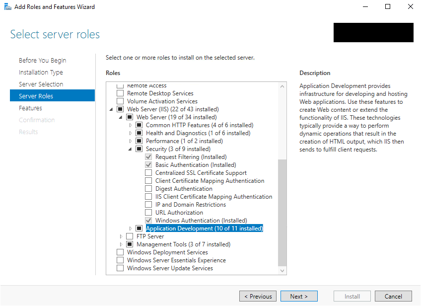
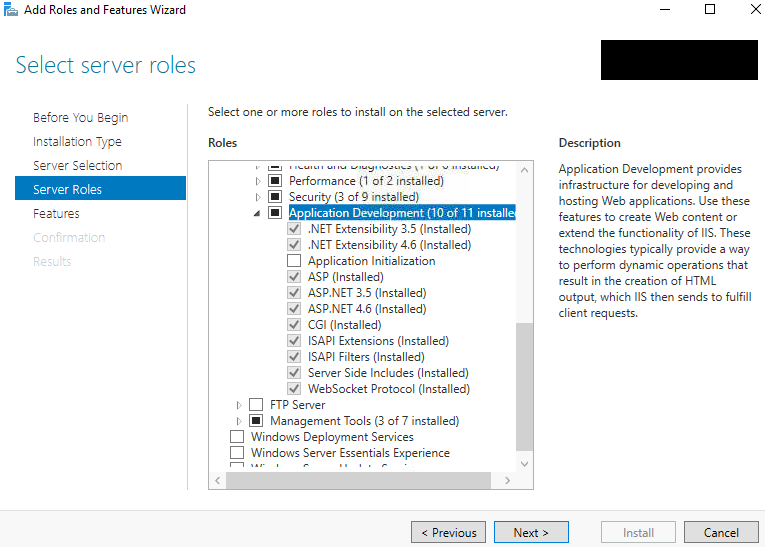
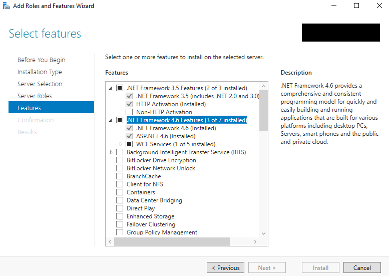
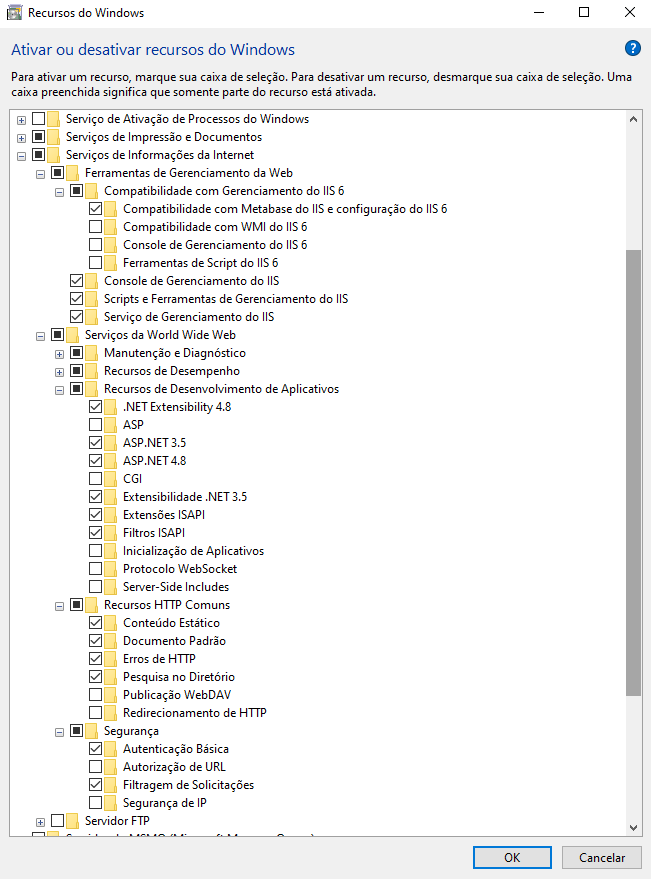
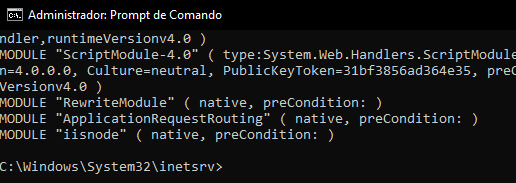
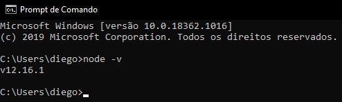
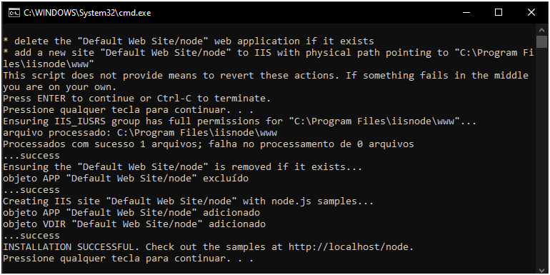
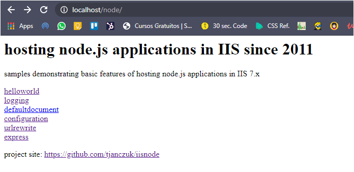
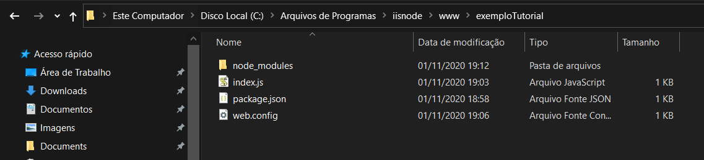
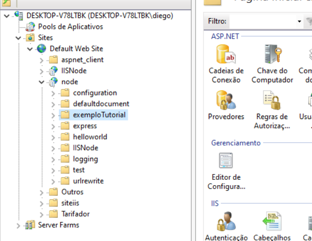

### IISNODE

#### 1 – O que é o IISNODE?

O IISNode é um módulo nativo do IIS que permite hospedar aplicações Node.js no IIS.

- [IISNode](https://github.com/azure/iisnode/wiki/iisnode-releases)

#### 2 – Pré-reuisitos

- Windows Vista, Windows 7, Windows 8, Windows Server 2008, ou Windows Server 2012
- IIS 7.x com IIS Management Tools e ASP.NET
- Módulo [URL Rewrite](https://www.iis.net/downloads/microsoft/url-rewrite) para IIS
- Módulo [Application Request Routing](https://www.iis.net/downloads/microsoft/application-request-routing) para IIS
- [Node.js](https://nodejs.org/en/)

##### 1.2 – Verificação dos pré-reuisitos

**- No Windows Server**

Favor abrir o `Server Manager` e escolher a opção `Add roles and features`

<br>

Em `Server roles`, nas opções de `Web Server (IIS) - Web Server - Security` favor verifiar os seguintes itens:

- Centralized SSL Certificate Support
- Client Certificate Mapping Authentication
- Digest Authentication
- IIS Client Certificate Mapping Authentication

Caso os mesmos não estejam instalados, favor marcar as opções para intalar, estes itens auxiliam para que o iisnode tenha acesso as variáveis do usuário logado entre outras.

<br>

Ainda em `Server roles`, agora nas opções de `Web Server (IIS) - Web Server - Application Development` favor verifiar os seguintes itens:

- NET Extensibility 3.X
- NET Extensibility 4.X
- ASP.NET 3.X
- ASP.NET 4.X
- ISAPI Extensions
- ISAPI Filters

Caso os mesmos não estejam instalados, favor marcar as opções para intalar, estes itens são necessários para o módulo do IISNode.

<br>

Agora em `Features` nas opções `.NET Framework 3.5 Features` e `.NET Framework 4.6 Features` favor verificar os seguintes itens:

- .NET Framework 3.X Features
  - .NET Framework 3.X
  - HTTP Activation
- .NET Framework 4.X Features
  - .NET Framework 4.X
  - ASP.NET 4.X

Caso os mesmos não estejam instalados, favor marcar as opções para intalar, estes itens são necessários para o módulo do IISNode.

**- No Windows**

<br>

Favor acessar acessar a opção de `Ativar ou Desativar Recursos do Windows` nas opções de `Serviços de Informação da Internet` favor verificar os seguintes itens:

- Ferramentas de Gerenciamento da Web
  - Compatibilidade com Gerenciamento do IIS X
    - Compatibilidade com Metabase do IIS e configuração do IIS X
  - Console de Gerenciamento do IIS
  - Scripts e Ferramentas de Gerenciamento do IIS
  - Serviço de Gerenciamento do IIS
- Serviços da World Wide Webe
  - Recursos de Desenvolvimento de Aplicativos
    - .NET Extensibility 4.X
    - ASP.NET 3.X
    - ASP.NET 4.X
    - Extensibilidade .NET 3.X
    - Extensões ISAPI
    - Filtros ISAPI
  - Recursos HTTP Comuns
    - Conteúdo Estático
    - Documento Padrão
    - Erros de HTTP
    - Pesquisa no Diretório
  - Segurança
    - Autenticação Básica
    - Filtragem de Solicitações

Caso os mesmos não estejam instalados, favor marcar as opções para intalar, estes itens são necessários para o módulo do IISNode.

**- Módulos do IIS**

Favor abrir o `CMD` como administrador e executar os comandos:

```bash
cd %systemroot%\system32\inetsrv\
appcmd.exe list modules
```

<br>

**- Node**

Favor abrir o `CMD` e executar o comando:

```bash
node  -v
```

<br>

#### 3 – Instalação

Estando todos os pré-requisitos verificados é necessário realizar o download do [IISNode](https://github.com/azure/iisnode/wiki/iisnode-releases) conforme o tipo do sistema.

O arquivo é um executável assim é necessário seguir as etapas de intalação.

Após a instalação favor navegar para a pasta que foi criada para o iisnode durante a instalação:

```bash
C:\Program Files\iisnode
```

Localizar e executar o arquivo `setupsamples.bat` como administrador.

<br>

Quando o arquivo abrir prosseguir apertando alguma tecla para criar e configur uma aplicação no iis, bem como garantir os corretos previlégios para a pasta.

Após a instalação acessar o seguinte link para verificar a aplicação:

```bash
http://localhost/node/
```

<br>

#### 4 – Adicionando sua aplicação no IISNODE

Exemplo de aplicação simples com express:

index.js

```javascript
const express = require('express');

const app = express();
app.use(express.json());

const iis_prefix = '/node/exemploTutorial';

app.get(`${iis_prefix}/`, (request, response) => response.json('teste'));

// EM TEMP DE DESENVOLVIMENTO
// const PORT = 3000;
// app.listen(PORT, () => {
// 	console.log('SERVIÇO:', 'RODANDO NA PORTA ' + PORT);
// });

// IISNODE
app.listen(process.env.PORT);
```

Exemplo de arquivo de configuração do IIS:

web.config

```xml
<configuration>
  <system.webServer>
	<iisnode
    nodeProcessCommandLine="&quot;%programfiles%\nodejs\node.exe&quot;"
    interceptor="&quot;%programfiles%\iisnode\interceptor.js&quot;"
  />
    <handlers>
      <add name="iisnode" path="index.js" verb="*" modules="iisnode"/>
    </handlers>
    <rewrite>
      <rules>
        <rule name="DynamicContent">
          <conditions>
            <add input="{REQUEST_FILENAME}" matchType="IsFile" negate="True"/>
          </conditions>
          <action type="Rewrite" url="index.js"/>
        </rule>
      </rules>
    </rewrite>
  </system.webServer>
</configuration>
```

Copiar a pasta da aplicação para a pasta do IISNODE:

<br>

Ao entrar no IIS é possível verificar que uma nova pasta foi criada para nosso projeto:

<br>

Para acessar aplicação e verificar se esta tudo ok é necessário acessar o seguinte endereço:

```bash
http://localhost/node/exemploTutorial
```

<br>

**Caso seja necessários fazer alterações no código quando o mesmo ja estiver na pasta do IISNODE é preciso abrir o arquivo web.config e salvar mesmo que o mesmo não tenha sofrido alterações para que as alterações em outros arquivos tenham efeito.**

#### 5 – Acessando pastas na rede

Caso a aplicação precise acessar pastas na rede para algum usuário que tem permissão é necessário criar um pool para a aplicação:

<br>
<br>
<br>
<br>
<br>
<br>
